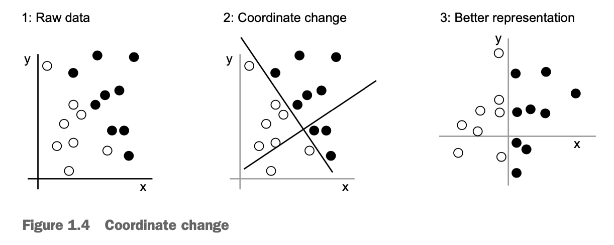
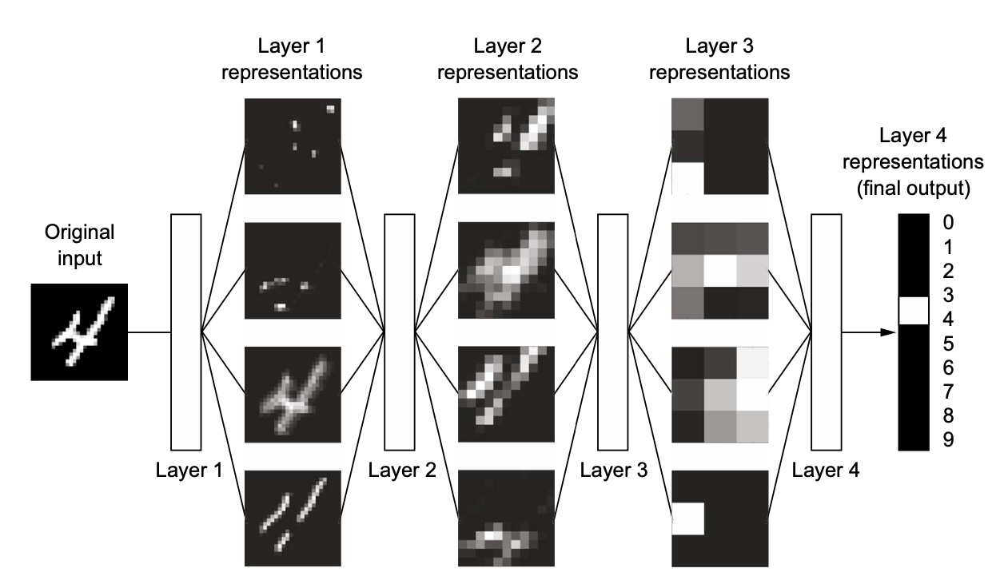
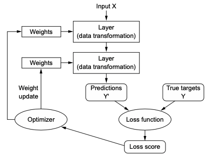

<strong>Image credit:</strong> Select figures reproduced from 
<a href="https://www.manning.com/books/deep-learning-with-python" target="_blank">
<em>Deep Learning with Python</em> by François Chollet</a> (Manning Publications, 2017). 
All rights reserved by the original publisher.

**Drawing some distinctions:**

Computer programming tells the computer the "rules" to obtain answers 

-	Rules + data => answers 

Machine learning learns “statistical” rules from the answers 

- Data + answers => rules 

Machine learning works with large, complex data sets – is an engineering discipline. Statistics works with smaller data sets  --  is a mathematical field. ML `\(\ne\)` statistics; rather, it emerges from statistics at most

**Required ingredients for machine learning**

1. input data
2. expected output
3. feedback, a measure of comparative performance -- the algorithm's output vs. the expected output

**What is learning, anyway?**

A machine learning model uses feedback to determine which representation of the input data is most performant.
Because of computing, multiple representations can be explored within a predefined set of operations. 

**What is a representation, anyway?** 

Any type of transformation of the data. As implied above, some transformations are more useful than others in determining the  model's output.

Example: say a model's objective is to find a rule that lets it identify white dots and black dots. It can transform the raw data by rotating it such that the new coordinate axes neatly separate the black and white dots along the y-axis. This is a useful transformation that yields a rule. To find this one useful transformation, the model cycled through other transformations.

<!-- -->

**What is DEEP learning?**

Refers to using many layers of transformations (each layer being a "representation") to identify rules. Each layer takes the representation that preceded it.

We call this configuration of layers a **neural network**. It is a type of machine learning model.

<!-- -->

**What are WEIGHTS?**

Each representation is *parametrized* by its weights, which are numbers that determine what a representation *does* to its input. 
Thus, finding a useful neural network (useful stack of representations) is contingent on finding the optimal weights. 

**Putting it all together: weights, representations, and learning** 

Learning occurs when a neural network, which is composed of representations parametrized by weights, finds the optimal weights for translating input into the desired output. 

**What do you mean optimal?** 

The optimal set of weights is determined based on a loss function, which takes a neural network's output `\(Y'\)` and compares it to the expected (true) output `\(Y\)`. It comes up with a score, which is then used by an optimizer to adjust the weights.

Weights are adjusted bit by bit until the weights that minimize the loss function are found. 

<!-- -->

